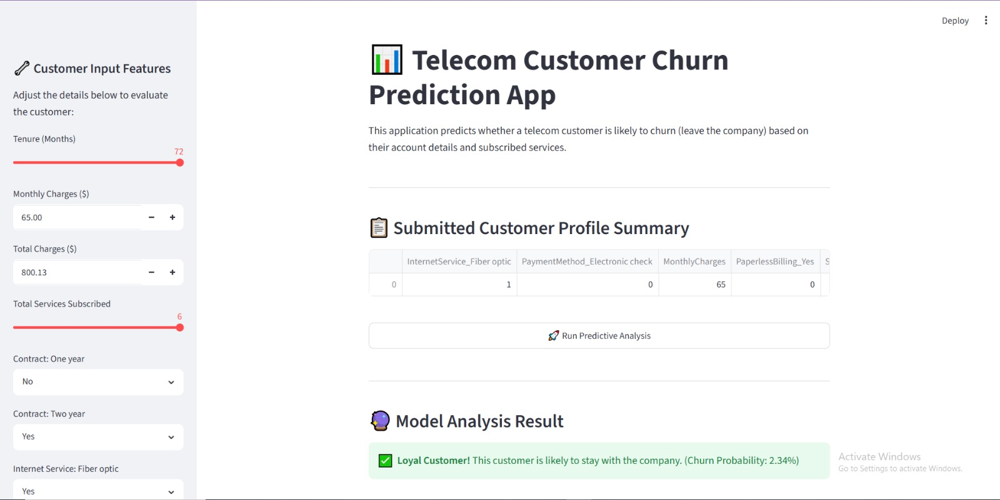
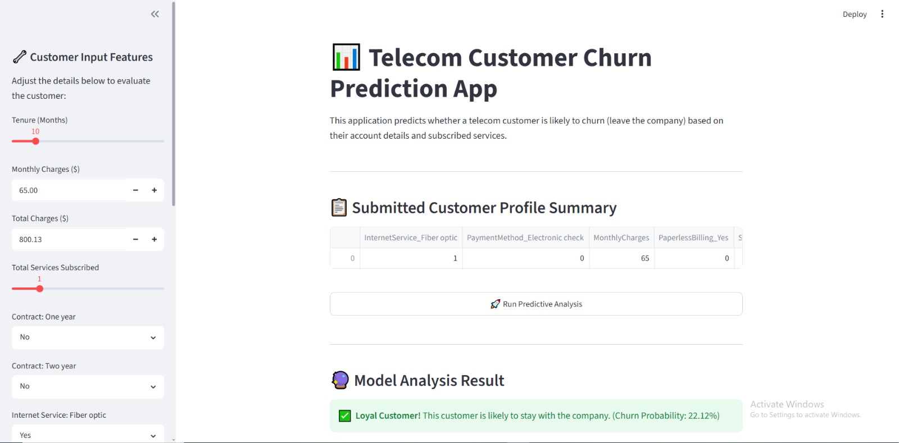
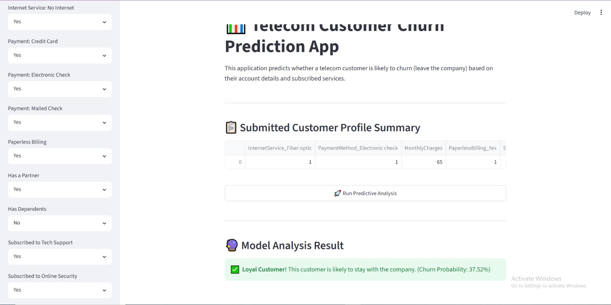
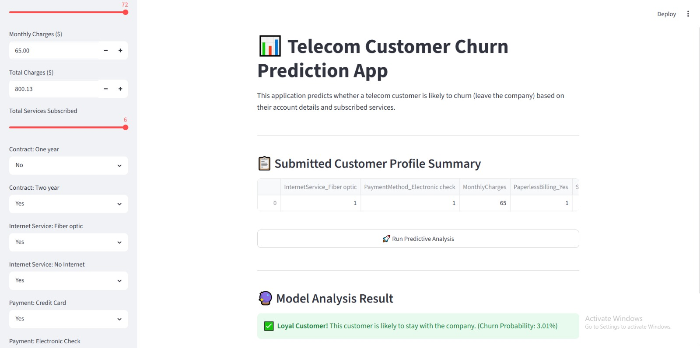

Markdown
# 📊 Telecom Customer Churn Prediction App

## 📋 Project Description
This project focuses on building an end-to-end Machine Learning pipeline to predict customer churn for a telecommunications company. Customer churn occurs when subscribers leave a service provider, making prediction crucial for customer retention strategies. 

The project involves data preprocessing and cleaning (handling missing values in `TotalCharges`), Exploratory Data Analysis (EDA) using 6 different specialized visualizations, feature engineering, and feature selection via the Filter Method (Correlation). We compared three distinct machine learning models (Logistic Regression, Random Forest, and Gradient Boosting) and performed hyperparameter tuning using `GridSearchCV`. The optimized **Gradient Boosting Classifier** was selected as the final production model and deployed into an interactive, user-friendly Web Application.

---

## 👥 Team Members
* **Tasabih Farid**

---

## 💾 Dataset Source & Download Link
* **Original Source:** IBM Kaggle / Telecom Churn Dataset
**Dataset Download Link:** [Download Dataset Here](https://github.com/Tasabihfarid/Telecom-Customer-Churn-Prediction)

--- 
## 🎬 Demo Video
📺 [Watch the full project presentation and app demo](https://drive.google.com/file/d/1WZ5rZ_B19HzERVIMeA8WYCQgkh_1qAKt/view?usp=sharing)

---
## 🎨 Dynamic Web Application Interface & Multi-Scenario Test Cases

### Scenario 1: Standard Customer Analysis (Baseline Drop)


### Scenario 2: High Risk Verification Profile


### Scenario 3: Fiber-Optic & Value Added Services Optimization


### Scenario 4: Paperless Billing & Long-Term Contract Safety Check

---

## ⚙️ Required Libraries & Dependencies
To run this project locally, you need Python installed along with the following libraries:
* `pandas`
* `numpy`
* `matplotlib`
* `seaborn`
* `scikit-learn`
* `joblib`
* `streamlit`

---

## 🚀 How to Run the Project Local Deployment

### 1. Clone or Download the Repository
Navigate to your project directory where the files are located:
```bash
cd Desktop\ML_Project
2. Install the Dependencies
Install all the required Python libraries using pip:

Bash
pip install pandas numpy matplotlib seaborn scikit-learn joblib streamlit
3. Run the Machine Learning Pipeline (Jupyter Notebook)
Launch Jupyter Notebook to view the data analysis, visualizations, model training, and tuning phases:

Bash
python -m notebook
Open and run Untitled1.ipynb to generate the saved model files (best_churn_model.pkl and selected_features.pkl).

4. Launch the Interactive Web Application
Run the Streamlit web application using the following command:

Bash
python -m streamlit run app.py
This will automatically open a local server window in your browser showcasing the interactive UI.

📊 Key Results & Output Screenshots
1. Exploratory Data Analysis (EDA)
We utilized 6 comprehensive charts (including distribution plots, boxplots, and density estimates) to analyze correlation and customer behavior metrics:

Model Baseline Results: * Gradient Boosting: Precision: 0.65, Recall: 0.51 (Successfully exceeding the project metric requirement of > 0.3)

Logistic Regression: Precision: 0.65, Recall: 0.53

2. Web Application Interface
The interactive dashboard allows the user to input custom customer profiles on the sidebar and instantly run predictive analysis to check churn risk probabilities.


---
